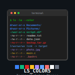
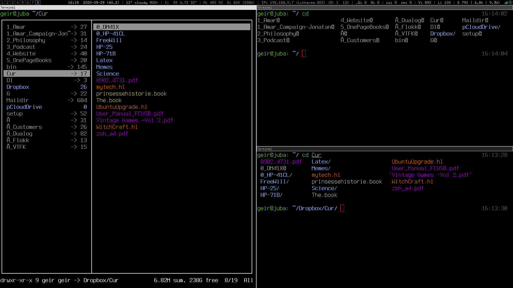

# LS_COLORS

[](https://www.gnu.org/software/bash/)
[](https://unlicense.org/)
[](https://github.com/isene/LS_COLORS/stargazers)
[](https://isene.org)


<br clear="left"/>

This is a color scheme for your terminal, suitable to use as your `LS_COLORS`
environment variable. Most of the colors use the extended color map, described
in the ECMA-48 document; in other words, you'll need a terminal with
capabilities of displaying 256 colors to take advantage of this.

Some 500+ different filetypes/extensions are supported.

The color scheme of [the original repo](https://github.com/trapd00r/LS_COLORS)
seemed somewhat random and lacking an overall color philosophy. I decided to
rewrite the complete color scheme based on this set of categories:

|FILE TYPES          | COLOR/FORMATTING
|--------------------|-----------------
|Directories         | Bold light blue
|Symlinks            | Bold gray (bold italics pink is orphaned)
|System files        | Underlined red
|Diff/Patch          | Bright pink (italics/bold)
|Files to ignore     | Dark gray
|Text                | Yellow
|Markdown            | Orange
|HTML-type files     | Brown
|Office-type files   | Burgundy-purple
|PDF and related     | Red-purple
|Media files/images  | Purple
|Programming related | Blue
|Binaries            | Bright cyan
|Executables         | Green
|Other file types    | White

File types within each category can have different shades of that color.

I use this as a sensible alias for ls in my .zshrc:

```
alias ls='ls --color=always -FH --group-directories-first'
```
For a consistent color experience between your command line and a curses file
manager, you may want to take a look at [RTFM](https://github.com/isene/RTFM).

There is also a corresponding [Ranger](https://ranger.github.io/) color scheme included `isene.py`. This covers only the categories above (no shading of files within a category - with a couple of exceptions) and not all the possible filetypes of the LS_COLORS provided. This will suffice until the Ranger project provides a color scheme that simply parses LS_COLORS instead. To use the isene.py Ranger color scheme, set it in your ranger/rc.conf.

I have also included a linemode plugin for ranger `ranger/plugin_linemode.py`.  Drop this file into your `~/.config/ranger/plugins/` directory and add this line to your ranger rc.conf:

```
default_linemode classify
```

# Installation
Clone this repo and run the install script `install.sh`

# Note for fish users
Users of the fish shell should source the resulting lscolors.csh file in their config.fish.

# What does it look like?
Here's a screenshot with three terminals with ranger running in the left terminal and the other two showing the output of ls:



# License
See [the original repo](https://github.com/trapd00r/LS_COLORS). 
